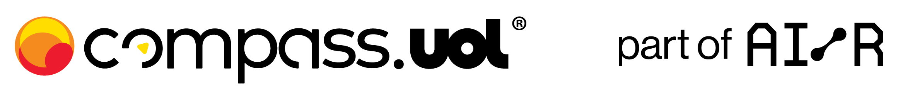

 
 
# Projeto de Bolsa CompassUol 

<h1 align="left">Olá , Me chamo Lucas Carvalho</h1>

##  ⚙️ &nbsp;Sobre mim 
#### 🔭 Estudante de Tecnólogo em Sistemas pela Internet - IFSUL (Campus Pelotas);  
#### 🔥 Estagiário na Empresa CompassUOL (Quality Assurence).  
#### 🌱 Aprendendo sobre QA, Backend, Frontend developer.  
####  📫 Como me encontrar

<a href="https://www.linkedin.com/in/lucas-carvalho-353102246/">
  <a/>
<a href="https://github.com/Lucas-Avila-Carvalho">
 
<a/>


## 🛠 &nbsp;Algumas das ferramentas que conheço

&nbsp;
&nbsp;
&nbsp;
&nbsp;
&nbsp;
&nbsp;
&nbsp;
&nbsp;
&nbsp;
&nbsp;

# Projeto NestJS Cinema com Playwright

Este projeto usa o framework NestJS para criar uma aplicação de cinema e Playwright para testes automatizados.

## Instalação

### Tecnologias utilizadas 

- **Node.js**: Ambiente de execução para executar aplicações em JavaScript fora do navegador.  
- **Playwright**: Ferramenta de automação de testes web que suporta navegadores como Chrome, Firefox e Safari.    
- **K6**: Ferramenta gratuita e de código aberto para testes de carga e desempenho.  
- **ChatGPT**: Solução de processamento de linguagem natural desenvolvida pela OpenAI.  
- **GitHub**: Plataforma de desenvolvimento colaborativo baseada no sistema de controle de versões Git.  
- **Postman**: Ferramenta para teste e documentação de requisições de APIs.  


### 1. Clonar o Repositório

Clone o repositório para sua máquina local:

```bash
git clone https://github.com/juniorschmitz/nestjs-cinema.git
cd nestjs-cinema
```
### 2. Instalar Dependências

Instale as dependências do projeto:

```bash
npm install
```

### 3. Rodar a Aplicação

Inicie o servidor:

```bash
npm run start
```

### 4. Configurar Playwright

Instale o Playwright para testes automatizados:

```bash
npm install -D playwright@latest
```

### 5. Criar e Executar Testes com Playwright

Adicione testes com Playwright criando arquivos em `tests` e rodando os testes com:

```bash
npx playwright test
```

## Planejamento de Testes

Planejamento de testes é o processo de organizar as atividades de teste, como definir os casos de teste, os recursos necessários e o cronograma. Esse planejamento ajuda a garantir que todos os requisitos sejam atendidos e que o software seja testado de maneira eficiente.

### Tipos de Testes

- **Testes Unitários:** Testam partes isoladas do código.
- **Testes de Integração:** Validam a interação entre módulos.
- **Testes Funcionais:** Verificam se a funcionalidade do sistema atende aos requisitos.
- **Testes de Carga:** Avaliam o desempenho sob alta demanda de usuários ou dados.

### Testes de Carga

Testes de carga simulam um número alto de usuários para verificar como o sistema se comporta sob pressão. São fundamentais para garantir que a aplicação suporte grandes volumes de acesso sem falhas.

#### Instalando k6

```bash
winget install k6 --source winget
```
#### Utilizando k6


```bash
k6 run seu-script.js
```
#### Automatizando por um arquivo

```bash
node seu-script.js
```
### Testes Automatizados

Testes automatizados são executados por ferramentas como Playwright ou Jest, permitindo que os testes sejam repetidos facilmente sempre que o código for alterado. Isso melhora a cobertura e reduz a quantidade de testes manuais.

## Reportando Issues no GitHub

Para reportar um problema:

1. Vá até a [página de Issues](https://github.com/Lucas-Avila-Carvalho/API-Cinema/issues) do repositório.
2. Clique em "New Issue" e descreva o problema detalhadamente.
3. Inclua informações como o comportamento esperado, o comportamento real e os passos para reproduzir o erro.
4. Se possível, adicione logs ou prints que ajudem a entender o problema.

## Licença

Distribuído sob a licença MIT. Veja [LICENSE](LICENSE) para mais detalhes.

Este README cobre a instalação do projeto, integração do Playwright para testes automatizados e conceitos gerais sobre testes, além de instruções para reportar problemas no GitHub.